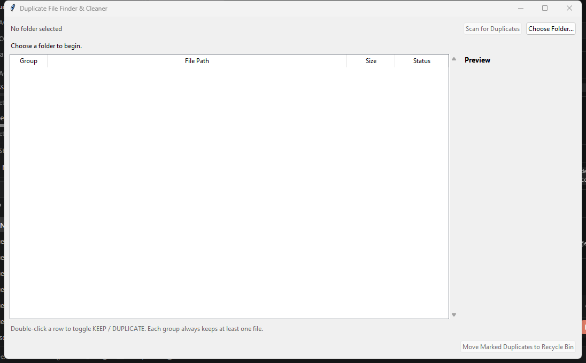
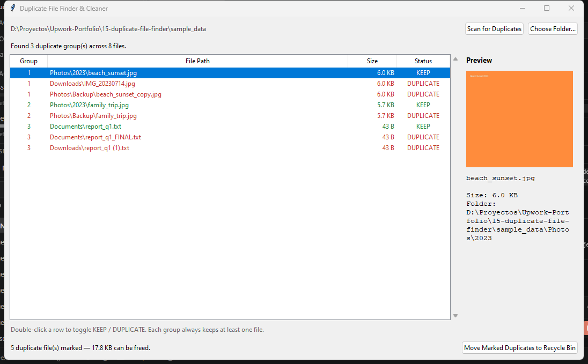

# Duplicate File Finder & Cleaner

A native desktop app (Tkinter) that scans any folder for byte-identical
duplicate files — photos backed up twice, the same document saved under
three names, a downloads folder full of re-downloaded copies — and lets
you review and clear them out safely, with nothing sent to the cloud.

Before scanning, just point the app at a folder:



After scanning a sample folder, duplicate files are grouped, color-coded,
and the app already picked a default file to keep in each group — with a
live preview panel for the selected file:



## What it solves

Anyone with years of accumulated photos, downloads, or document exports
ends up with the same file copied across multiple folders — wasting disk
space and making it hard to trust which copy is current. Manually
comparing file names doesn't catch real duplicates (different name, same
content) and can't be trusted to skip files that only *look* similar.

This tool:

- Scans a folder (and all subfolders) and finds files that are truly
  **byte-for-byte identical**, regardless of their name or location.
- Groups duplicates together, automatically keeps the oldest copy as the
  "original," and marks the rest for removal — each group's choice can be
  overridden with a double-click.
- Shows an image preview (or size/path details for any other file type)
  before anything is removed.
- Sends marked duplicates to the **Recycle Bin**, never a permanent
  delete — an accidental removal is always recoverable.
- Reports how much disk space can be freed before you commit to anything.

## How it works

- **`duplicate_finder.py`** is a facade over the filesystem and `hashlib`:
  the GUI calls one function, `scan_for_duplicates()`, and never touches a
  hash or a raw file handle itself. Detection runs in three passes so the
  expensive part — reading full file content — only happens for files that
  already look like real candidates:
  1. **Group by file size** (a dict, O(n)). A file whose size is unique in
     the whole scan cannot have a duplicate, so it's dropped immediately
     without ever being opened.
  2. **Group by a partial hash** of just the first 4 KB of same-size files.
     This is a constant-size read regardless of file size, and filters out
     most same-size-but-different-content files cheaply.
  3. Only files that still collide after steps 1-2 get a **full SHA-256
     hash**, streamed in 1 MB chunks so large files (videos, archives)
     never load fully into memory. Files sharing size + partial hash + full
     hash are true duplicates.

  This avoids both the naive O(n²) "compare every file to every other
  file" approach and unnecessary full reads of large files that were never
  real candidates to begin with.
- **`app.py`** is the Tkinter UI. The scan runs on a background thread —
  `duplicate_finder.py` is pure filesystem/hashlib work with no GUI
  awareness — so the window never freezes while a large folder is being
  hashed; progress updates flow back through a thread-safe queue polled by
  the Tkinter main loop, the standard safe pattern for updating widgets
  from another thread.
- Deletion goes through [`Send2Trash`](https://pypi.org/project/Send2Trash/),
  which moves files to the OS Recycle Bin instead of calling `os.remove()`
  — so a mistaken selection is never unrecoverable.
- Verified end-to-end against a synthetic sample folder (`sample_data/`)
  containing real duplicate photos and text files mixed with unique ones:
  confirmed the exact expected groups were found, that unique-size files
  were correctly skipped without being hashed, and that sending a marked
  file to the Recycle Bin actually removed it from disk while leaving it
  recoverable.

## Running it locally

```bash
py -3.12 -m venv venv
venv\Scripts\python.exe -m pip install -r requirements.txt
venv\Scripts\python.exe app.py
```

Click **Choose Folder...**, pick `sample_data/` (included in this repo) to
try it immediately, then **Scan for Duplicates**.

## Adapting it to another use case

- **A different match rule** (e.g. "same filename regardless of content,"
  or fuzzy image similarity instead of exact bytes) would replace the
  hashing step in `duplicate_finder.py` — the GUI only depends on getting
  back a list of `DuplicateGroup` objects, not on how they were computed.
- **A "move to folder" action instead of Recycle Bin**: swap the
  `send2trash()` call in `app.py`'s `remove_duplicates()` for a
  `shutil.move()` into a quarantine folder — useful for a client who wants
  a manual review step before anything leaves the original location.
- **A CLI/batch mode for scheduled cleanup**: `duplicate_finder.py` has no
  Tkinter dependency, so it can be imported directly into a script that
  scans a folder unattended and writes a report — no GUI changes needed.

## Portfolio note

Built as part of a daily portfolio series. This is the first project in
the series delivered as a **native desktop GUI** (Tkinter, no browser, no
server) rather than a web app — a fit for local file-system tools that a
non-technical user should be able to just double-click and run. See the
`LICENSE` file for reuse terms.

## License

This project is shared for portfolio and educational purposes. See
[LICENSE](LICENSE) for details.
